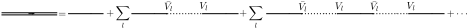

.. impurity_problem

================
Impurity problem
================

Start working on the problem of a single $d$-impurity in a flat conduction bath
of electrons. It will be represented by the Hamiltonian:

.. math::
  \mathcal{H} = \epsilon_d d^\dagger d + \sum_l (V_l d^\dagger c_l + h.c.)
    \sum_l \varepsilon_l c^\dagger_l c_l

where $d^\dagger,d$ create (annihilate) a fermion in the impurity, $\epsilon_d$
is the impurity energy level. $c^\dagger_l, c_l$ create (annihilate) a fermion
in the bath state $l$, $V_l$ is the hybridization amplitude of the fermion
hopping from the bath into the impurity and $\varepsilon_l$ is the bath
dispersion. This is a quadratic Hamiltonian and one can diagonalize it but I
will treat a method by Green's functions and diagrams.

Green's Functions
=================
Working in Matsubara frequencies the Green's function for the isolated impurity
is:

.. math:: G^0_d(i\omega_n) = \frac{1}{i\omega_n - \epsilon_d}

and its propagator will be drawn as: |fermion_gf|

The Green's function of an isolated bath site is: |fermion2_gf|

.. math:: G^0_{c_l}(i\omega_n) = \frac{1}{i\omega_n - \varepsilon_l}

To include the hybridization term into the impurity Green's function one studies
the behavior of the impurity. It can propagate freely, propagate into the bath
and back and can repeat this process any number of times.

The sum of this events gives the full Green's function(not writing the function
argument $G_d(i\omega_n) \rightarrow G_d$)

.. math::
  G_d =&  G^0_d +
    \sum_l G^0_d \left[ \bar{V_l} G^0_{c_l} V_l \right] G^0_d\\
    &+ \sum_{l,l'} G^0_d \left[ \bar{V_l} G^0_{c_l} V_l \right] G^0_d
    \left[ \bar{V_{l'}} G^0_{c_{l'}} V_{l'} \right] G^0_d + \cdots

replacing $\left[ \sum_l \bar{V_l} G^0_{c_l} V_l \right]G^0_d \rightarrow x$ it is
easy to see its a power series

.. math::
   G_d =  G^0_d( 1 + x +x^2 +\cdots) = G^0_d \lim_{n\rightarrow\infty}
   \frac{1-x^n}{1-x}

if $|x|<1$ then $G_d$ is finite and because the original problem was quadratic
and solvable that condition is here also fullfilled. One the obtains

.. math::
  G_d(i\omega_n) = \frac{G^0_d(i\omega_n)}{1-x} = \left[ i\omega_n - \epsilon_d
  - \sum_l \frac{|V_l|^2}{i\omega_n - \varepsilon_l} \right]^{-1}

and one defines the hybridization function

.. math::
  \Delta(i\omega_n) = \sum_l \frac{|V_l|^2}{i\omega_n - \varepsilon_l}

Example: Impurity in a flat bath
--------------------------------

Taking a costant hybridization amplitude $V_l=V$ and a flat density of states
for the bath with bandwith $D$ represented as:

.. math::
  D(\varepsilon) = \sum_l \delta(\varepsilon-\varepsilon_l)
   = \frac{\theta(D^2-\varepsilon^2)}{2D}

In that case the hybridization function can be calculated as:

.. math::
  \Delta(i\omega_n) = \frac{|V|^2}{2D}
  \int \frac{d\varepsilon\theta(D^2-\varepsilon^2)}{i\omega_n - \varepsilon}
